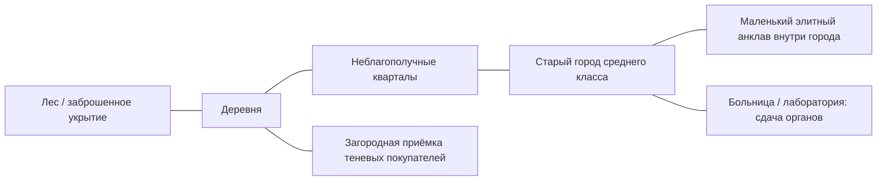

# VOLUNTEERS ONLY — карта, сюжетная прогрессия и задание на референс

**Рабочая редакция:** 0.3, 04.10.2026. **Статус:** последовательное уточнение требований с Федей. Предыдущий предложенный портовый город заменён прямыми уточнениями пользователя. Стартовое укрытие и начало сюжетной прогрессии определены ниже; размеры всей карты, дальнейшие главы, число баз и препятствия доступа ещё уточняются. Карта не реализована.

## 1. Подтверждённое направление

- Карта связана с сюжетом и по мере прохождения открывает новые локации.
- Несколько общих баз команды, которые становятся доступны постепенно. Базы не закреплены за отдельными игроками.
- Просторные длинные улицы и удобное движение на бусике. Размер должен оправдывать поездки, поиск взрослых NPC и их перевозку.
- Обычная поездка на бусике от стартовой базы до центра старого города занимает примерно одну минуту без остановок и погони. Это временной ориентир, а не уже вычисленная длина дороги.
- Мир заметно больше очень маленькой городской площадки, но существенно меньше огромного мира масштаба GTA V. Это сравнение ощущения масштаба, а не требование копировать другую карту.
- Старт непосредственно в лесу или заброшенной местности.
- Далее: сельская местность / деревушка → неблагополучные кварталы → старый город среднего класса.
- Очень маленький элитный район находится **внутри старого города**, а не образует отдельный большой удалённый регион.
- Элитных NPC мало; они самые дорогие, спрос на них высок, защита наиболее сильная.
- Районы различаются внешним видом, составом NPC и условиями захвата. Пользователь хочет различие в потенциальном качестве игрового товара между районами.
- Отдельная лаборатория или больница для сдачи органов; загородная приёмка для встреч с теневыми покупателями.
- Дешёвая в производстве, гармоничная и привлекательная low-poly графика.

## 2. Связь с существующим продуктом

Опоры из [PRODUCT.md](PRODUCT.md) и [канона](VOLUNTEERS_ONLY_GAME_SPEC_AND_LORE_CURRENT_CANON.md): 1–4 игрока, полноценное соло, взрослые NPC, физический захват и перевозка, системная мультяшная комедия, развитие бизнеса, общая основа поведения NPC, деньги и XP, старые базы сохраняются. Ближайший производственный срез остаётся NPC + VAN FUN TEST; документ не означает заказ на немедленное строительство всей карты.

Старое направление почти полностью открытого города со старта теперь требует согласования с новым запросом о последовательном открытии локаций. Как именно закрываются территории — открытый вопрос. Конкретный сюжет и названия мест в исходном каноне не заданы.

Неблагополучные NPC — игровая характеристика и состав населения; визуальное богатство района не является объяснением реальной медицинской ценности человека. Для игры нужно отдельно определить параметры качества: состояние NPC, сохранность при перевозке, редкость требуемых вариантов и распределение подходящих целей.

## 3. Географическая последовательность

Схема показывает соседство и экономические роли. Она пока не утверждает форму дорог, этапы доступа и точное размещение баз. Итоговая сеть должна иметь петли и второстепенные связи; географическая последовательность не превращается в один обязательный коридор.

Общие базы расположить в разных частях этой цепочки, чтобы расстояние до доступных NPC и покупателей постепенно меняло выгодное место работы команды. Количество, габариты и точные помещения определить вместе с этапами сюжета.

## 4. Лес / заброшенная стартовая территория

Первое укрытие команды — заброшенный железнодорожный вагон в лесу возле неиспользуемых путей. Внутри одна тесная комната для первоначальной работы и упаковки. В дальнейшем команда переезжает в другие общие базы. Это именно железнодорожный вагон, а не строительный вагончик, жилой дом или уже оборудованная лаборатория.

В начале в вагоне уже находятся взрослые NPC под действием наркотиков: для первого игрового сбора крови их не требуется серьёзно одолевать. Следующие доступные NPC находятся на ближайшем краю деревни: до появления бусика их можно доставить пешком.

Лес должен поддерживать происхождение бизнеса и первую поездку к деревне. Нужны ясный выезд, пространство перед зданием и видимая связь с основной дорогой. Не требуется огромная система выживания, охота на животных или сбор ресурсов.

Лесная масса делается простыми повторяемыми деревьями и рельефом. Важны гармоничный силуэт и ясная дорога; не количество индивидуальных стволов, листьев и кустов. Это не хоррор-лес с постоянным туманом.

## 5. Деревня

Первая населённая рабочая территория. Низкая плотность, сельские дома и простор между участками; сравнительно мало полиции и свидетелей. Бусик позволяет искать цели на удалённых друг от друга участках, а не служит декоративным транспортом для поездки через две улицы.

Низкое давление не означает абсолютное отсутствие реакции: очевидный захват рядом с конкретным свидетелем может иметь последствия. Начальный опыт должен быть достаточно спокойным, чтобы учить остановке машины, выбору места и погрузке.

Загородная приёмка расположена близко к сельской зоне или дороге между деревней и окраинами. Её точное место и роль в продажах уточняются отдельно.

## 6. Неблагополучные кварталы

Переход от редкой сельской застройки к городской. Старые дома, простые магазины, дворы и служебные проезды. Здесь чаще встречаются маргинальные взрослые NPC, но население не состоит целиком из одного архетипа.

По запросу пользователя вероятность широкого внимания к исчезновению таких NPC сравнительно низкая. Это не отменяет немедленную реакцию человека, который видит происходящее, или индивидуальных родственников из канона.

Визуальное неблагополучие передают состояние и организация пространства: разномастные фасады, пустующие помещения, простые ограды, редкие благоустроенные участки. Не нужна тяжёлая фотореалистичная грязь или десятки мелких объектов мусора.

## 7. Старый город

Основная развитая городская территория среднего класса. Длинные достаточно широкие улицы, обычные дома, магазины, общественные пространства и автомобильные связи между кварталами.

Свидетелей и полиции больше, патрули заметно чаще. Пользователь допускает местную и районную полицию; разница в внешнем виде, частоте или поведении ещё требует определения. Не считать это автоматически заказом на две сложные системы полицейского AI.

Здесь нужна читаемая разница между удобной публичной парковкой и более далёким тихим местом погрузки. Больница/лаборатория образует один из понятных пунктов доставки, а не невидимую кнопку продажи.

## 8. Маленький элитный район внутри старого города

Эта зона мала относительно города. Сохраняется общая архитектурная логика, но видно больше пространства у домов, более аккуратные фасады, ухоженные ограды и контролируемые подходы.

Крутых NPC мало. Не превращать квартал в бесконечный конвейер самых выгодных целей. Состав населения, частота появления, повторные визиты и условия специальных заказов требуют настройки.

Самая сильная защита должна иметь читаемую форму: охрана, патрули, свидетели или ограничения подъезда. Конкретный набор ещё не выбран; камеры, сканеры, сложный стелс и система личных пропусков не подразумеваются автоматически.

Высокая сложность сохраняет полноценное соло. Не требовать обязательной синхронной работы нескольких игроков для единственного сюжетного прохода.

## 9. Две внешние точки торговли

**Больница/лаборатория:** отдельное место, куда команда доставляет игровой товар. Это не автоматически собственная база игроков. Условия приёмки, открытость учреждения и отличие обычных продаж от специальных заказов ещё уточняются.

**Загородная теневая приёмка:** место встречи с покупателями за пределами плотного города. Должны быть подъезд, возможность остановить фургон и небольшое узнаваемое пространство сделки. Это не обязательно самостоятельный большой район.

Нужно избежать одинаковой функции двух покупателей с разными фасадами. Их предложение, доступность и место в сюжетной прогрессии будут определены в полной редакции. Перекупщик из канона может сохраняться как надёжный способ продажи обычного товара, но его связь с этими точками ещё не утверждена.

## 10. Принципы дорог и перевозки

- Несколько длинных широких участков позволяют комфортно вести бусик; расстояния действительно сокращаются транспортом.
- На основной сети есть понятные повороты, обзор и места остановки. Дороги не забиты постоянными искусственными препятствиями.
- Отдельные дворы и проходы могут быть теснее: они создают вариативность захвата, но не превращают весь город в неудобный лабиринт.
- У каждой базы и важной точки продажи есть нормальный подъезд и место открыть задние двери фургона.
- Работающие петли, объезды и короткие пути сохраняют выбор маршрута после открытия новых территорий.
- Длинная дорога поддерживает поездку; пустая пятиминутная перегонка без решений не является самоцелью.
- Конкретные длины, ширины и размеры карты будут выведены из желаемого времени поездки и реального поведения игрового транспорта.

## 11. Принципы качества и районной вариативности

Пользователь хочет повышение ценности потенциальных целей от стартовых мест к городской и элитной части. Для настройки нужно разделить:

1. Частоту подходящего архетипа в районе.
2. Его потенциальные игровые характеристики/редкость.
3. Состояние после захвата и перевозки.
4. Спрос конкретного покупателя и доступные заказы.
5. Пространственный риск, свидетелей и защиту.

Предварительное предложение: различать распределения и вероятность, а не гарантировать «деревня всегда мусор / элита всегда идеал». В ранних местах остаются полезные обычные NPC, а редкие интересные исключения поддерживают возвращение. Это правило качества пока требует подтверждения пользователя.

## 12. Что требуется от будущего визуального референса

Сначала нужен план сверху: взаимное положение леса, деревни, неблагополучных кварталов, старого города, маленького элитного анклава, больницы, приёмки, баз и длинных автомобильных связей. Потом — вид под углом той же географии и отдельные примеры районов.

Общий стиль: moderate low-poly, крупные чистые формы, простые гармоничные цвета, ограниченная детализация, выразительные силуэты, обычный мягкий дневной свет. Районы отличаются плотностью, масштабом зданий, благоустройством и дорожной сетью, а не шестью несвязанными художественными стилями.

Существующие CityMood/BaseMood/GameplayMood в ArtSource/References остаются приблизительным ориентиром. Новый лесной старт и последовательность мест заданы пользователем и имеют приоритет над прежним предложенным портовым планом.

Изображение не должно выдавать красивую плотную игрушечную диораму вместо просторной ездовой карты. Проверять расстояния и дороги по схеме и серому макету; генератор изображения сам по себе не гарантирует проходимость и масштаб.

## 13. Первые вопросы для следующей редакции

Масштаб поездки уточнён: лесное укрытие → центр старого города около одной минуты на бусике. Бусика на старте нет: команда зарабатывает на него в доступной окрестности. Последовательность начала сюжета задана в разделе 14.

Следующий открытый вопрос: где находится новая локация со знакомыми первого покупателя, принимающими не только кровь? Также нужно определить последующие сюжетные главы и форму доступа к территориям.

После этих ответов уточнить: роль двух покупателей, тип первой базы, устройство защиты элитной зоны и правила распределения качества NPC. В полной спецификации нужны связная история, районные паспорта, базовые планировки, таблица прогрессии, дорожный каркас, требования к визуальным листам и критерии игрового теста.

## 14. Подтверждённый пролог: кровь → бусик → новые покупатели

1. Команда замечает на столбе объявление о приёме крови за деньги с номером телефона. Размещение объявления должно позволить увидеть его до знакомства с первым покупателем.
2. В заброшенном вагоне обнаруживаются взрослые NPC под действием наркотиков. Рядом находятся использованные ими шприцы. Это стартовые игровые предметы и контекст сцены; реальная медицинская процедура не задаётся.
3. Игроки вспоминают объявление и выполняют упрощённое игровое действие сбора крови в шприцы.
4. Звонят по указанному номеру. Этот покупатель приезжает к вагону по вызову.
5. Он говорит, что приём в шприцах несерьёзен, но один раз даёт небольшую сумму. Её хватает на несколько наборов специальных пакетов.
6. Дальнейший приём крови этим покупателем возможен только в специальных пакетах. Одноразовая вводная сделка не должна повторяться как бесконечная продажа неподходящей упаковки.
7. Пока кровь не в специальном пакете, у неё есть игровой срок годности. По формулировке пользователя упаковка убирает эту первоначальную угрозу порчи. Числа времени, объём и интерфейс ещё не выбраны.
8. Команда сначала зарабатывает **только на крови** и покупает первый бусик. Органы не становятся обязательным источником дохода до покупки транспорта.
9. Позже тот же покупатель намекает на знакомых в другой локации, принимающих не только кровь. Знакомство с ними происходит после покупки бусика и связывает транспорт, расширение географии и переход к органам.

Не считать пока определёнными: место продажи упаковки и бусика; точный момент намёка относительно покупки; расположение новых покупателей; следующую базу; набор первых органов и инструментов; способ открытия новой территории. Покупка бусика должна быть достижима через доступные сделки с кровью, без требования выполнить ещё закрытый органный заказ.

Визуальные опоры пролога для будущего референса: старые железнодорожные пути, однокомнатный вагон среди леса, столб с объявлением, подъезд для приезжающего покупателя, пешая связь с краем деревни и дальнейший автомобильный выезд к городу. Число NPC, расстояния и арт предметов ещё требуют проектирования.
