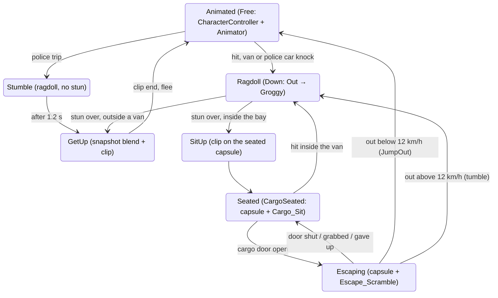

# NPC ragdoll and animations — stage 9 design

> **Status: draft for Fedya and the lead, not canon.** Date: 2026-10-07. Design only: no code, assets or settings were changed.
> Scope (Fedya's split of 2026-10-07): our side does NPC ANIMATIONS and the FULL RAGDOLL (stage 9). Vadim keeps the NPC look,
> face and district variety (NPC_BASE_01 line) and now finishes the map.
> Agreed scope of stage 9 (TASK of 2026-10-05, «после подгрузки анимаций … займёмся»): bones instead of one body, arms and legs
> dangle, grab ANY part, smooth animation ↔ ragdoll transitions, get-up animations from the back and from the belly, network sync
> of key bones only (later). Carrying target (third playtest, 2026-10-06): «один человек мог затаскивать с небольшими усилиями,
> а вдвоём прям легко — за ноги, за руки и запихали».

---

## Кратко для Феди

**Что делаем.** Лежачий NPC перестаёт быть одной «колбасой-капсулой». Когда его вырубают, он становится тряпичной куклой из
11 физических частей: таз, грудь, голова, плечи, предплечья (вместе с кистью), бёдра, голени (вместе со стопой). Руки и ноги
болтаются, хватать можно за любую часть. Когда он приходит в себя, он встаёт настоящей анимацией: со спины или с живота,
смотря как лежит. Ходит, бегает и сидит в кузове он по-прежнему анимациями.

**Главное, что выяснилось при разборе.**
1. **Скелет.** У нашего Buddy и у NPC Вадима (NPC_BASE_01, v05 и v09) скелет один и тот же: 65 костей Mixamo, те же имена,
   те же родители, та же поза покоя (расхождение меньше 1,2° на всех костях тела; отличаются только большие пальцы и носки).
   Поэтому анимации, сделанные на Buddy, лягут на финального NPC Вадима без перевода в Humanoid. Остаёмся на Generic, а с
   Вадимом фиксируем «договор о скелете» (раздел 1). Humanoid держим запасным вариантом.
2. **Тряпичная кукла тяжелее в руках, чем капсула.** Капсула жёсткая: подняв голову, ты нёс только половину веса, вторую
   держала земля под ногами. У куклы туловище и ноги складываются, и рука несёт почти всё, что оторвалось от земли. По
   расчёту (раздел 3.3) поднять NPC за ворот до пояса одной рукой — около 230 Н при пределе руки 240 Н, а вдвоём «за ворот и
   за ногу» почти весь вес достаётся тому, кто держит верх. То есть без помощи получится наоборот: одному тяжело, вдвоём
   неудобно.
3. **Поэтому нужны незаметные «помощники»** (все с настройками, раздел 3.4): пока NPC держат, он чуть легче (на 20 % для
   одного держащего, на 35 % для двоих); туловище в руках слегка «держит форму»; таз и живот — «плохая ручка» (одной рукой
   таз не поднять, как ты и хотел); ворот, руки, ноги и голова — «хорошие ручки». Цель: одному — с небольшим усилием (как
   сейчас с капсулой, около 190 Н), вдвоём — легко (каждому не больше 160 Н, тело целиком над землёй).

**Что нужно решить тебе** (раздел 8.4):
- оставить ли правило «таз одной рукой не поднять»;
- можно ли телам в закрытом едущем бусике «замирать», если они будут трястись (запасной вариант на случай дрожания);
- вставания делает GPT в Blender (как ходьбу), или ты/Вадим скачиваете готовые из Mixamo (нужен ваш аккаунт Adobe).

**Что нужно от Вадима:** подтвердить «договор о скелете» (имена костей Mixamo, T-поза, имя объекта арматуры, настройки
экспорта) и параметры Animator из записки ему (раздел 5.4), а потом уже сетевую часть.

**Тесты — с жёстким лимитом.** Один автотест рэгдолла на 9 проверок, не дольше 90 секунд. Агенту — не больше 3 прогонов на
этап; дважды упало по одной причине — остановка и отчёт, никаких бесконечных подгонок цифр под тест. Всё, что про
ощущения, — твой плейтест в конце каждого этапа, 5–8 пунктов, до 10 минут.

**Порядок** (раздел 8): сначала кукла при оглушении и перетаскивание за любую часть (переключатель «капсула ↔ кукла» для
сравнения), потом помощники и погрузка в бусик, потом вставание со спины и живота, потом брыкание и побег из бусика, потом
анимации толпы, кузова и полиции. Каждый этап можно сразу попробовать в `Map_Look_v12_Play`.

---

## 0. Sources and what exists today

Read for this design: canon §§109–139, 147, 150, 151 (`docs/VOLUNTEERS_ONLY_GAME_SPEC_AND_LORE_CURRENT_CANON.md`);
`docs/drafts/NPC_CAPTURE_VAN_COOP_DRAFT.md`; `docs/drafts/NPC_CAPTURE_STAGE1_NOTES.md` (all three playtest rounds);
`docs/drafts/VADIM_AGENT_BRIEF_2026-10-05.md` (§0 update and §4 hook-up contract); `docs/art/BUDDY_WALK_2026-10-06.md`;
code in `Map/Scripts` (GreyboxNpc, GreyboxNpcBody, GreyboxInteractor, GreyboxVanCargo, Combat/WeaponStun, Dev/NpcLoadingTest,
Crowd/*), `Player/Scripts/Physics/*`, `Police/Scripts/PoliceOfficer.cs`, `PoliceCarMotor.cs`, `Network/Scripts/*`,
`Map/Editor/GreyboxBuddySetup.cs`, `MapGreyboxBuilder.cs`; the Buddy and NPC_BASE_01 Blender sources (inspected headless,
Appendix A); `ProjectSettings/DynamicsManager.asset`, `TimeManager.asset`.

Facts the design builds on:

| Area | Today |
| --- | --- |
| Downed NPC | `GreyboxNpcBody`: ONE capsule Rigidbody added to the NPC root (root at the feet) on knockdown, removed on waking. 1.5 m × r 0.28, `DownedMass` 28 kg, seated/escaping 40 kg, friction 1.0 static / 0.3 sliding (Average), roll damping 4/s, up to 3 holders, claims projected onto the capsule axis, F9 debug pins. The mesh stays in its standing Idle pose, rotated with the capsule. |
| Hand | `PhysicsGrabber` point path (`IGrabPointTarget` on the Rigidbody's GameObject), `NpcGrabProfile`: 240 N up/down, 260 N sideways, spring 1200, ζ 0.6 relative to the hand, max 6 m/s, hold 0.6–2.5 m. Damping uses `grabbedBody.mass`. `grabbedColliders = body.GetComponentsInChildren<Collider>()`. |
| Stun | Fist 8 s base × head 1.5 / torso 1 / limb 0.5 ± 15 %. Out = first 60 % (limp), Groggy = rest (kicks every 1.0–1.8 s, tear chance {0, 0.2, 0.05, 0} by holders, crawls if unheld). Impact > 5.5 m/s wakes early. Timer runs while held. |
| Cargo | `GreyboxVanCargo`: loaded = pelvis and collar landmarks inside `VanCargoSpace`, nobody holds, at rest relative to the van for 0.5 s; loaded bodies damped toward the van velocity (1.5/s); wake in the bay → `CargoSeated` (1 m upright capsule, layer `NpcSeated`, mesh sunk by `SeatedVisualDrop` 0.4 m, no sit clip); escape on an open door → run or crawl; out above 12 km/h → `KnockOver` (down again). |
| Tests | `NpcLoadingTest`: 19 checks, ~35–60 s wall clock at TimeScale 3, capsule-specific (two-step rigid loading, axis positions). Last result 19/19. |
| Physics settings | 60 Hz fixed step, PGS solver, 6 position / 1 velocity iterations, Improved Patch Friction ON, sleep threshold 0.005, default max angular speed 50, max depenetration 10. |
| Layers | 8 Player, 9 RemotePlayer, 10 Vehicle, 11 VehicleInterior, 12 NpcBody, 13 NpcSeated (`OvLayers`). |
| NPC visual | `SausageBuddy_A/B.prefab` (v04 FBX), Generic avatar, controller `SausageBuddy_Greybox.controller` (GUID d8645f8f…): states Idle, Walk, Run, TurnFlee, **no parameters**; code crossfades by state name (`GreyboxNpc.Play`). Animator `AlwaysAnimate` because the FBX's stored pose puts the hips ~11 m below the root (see 1.5). |
| Crowd / police | `CrowdDirector` pool of 76 inactive Buddies, ~61 active on `Map_Look_v12_Play`; `CrowdActivity` poses are mesh offsets (sit = sink 0.35 m, lie = tip over). Police: 4 cars, 8 crew; fat officers "trip" (Idle for 1.2 s); `Beat`, `Aim`, `Bang` states have no clips. |
| In flight | `ArtSource/Characters/SAUSAGE_BUDDY_01/Animations/GetUp_Idle_v01/` appeared 2026-10-07 00:24 with only `inspect_getups.py` and `source_inspection_v01.json` (read-only inspection of A v04). If a GPT job is authoring get-ups there, align it with §5.3 before it exports. |
| Not implemented | GripAnchor (canon §§115–120), NPC resistance beyond kicks/crawl, NPC network objects. |

---

## 1. Rig decision: keep Generic, lock a skeleton contract, keep Humanoid as the fallback

### 1.1 What the rigs are (Blender 5.2 headless inspection, Appendix A)

| | Sausage Buddy A v04 | NPC_BASE_01 v05 | NPC_BASE_01 v09 (README: current) |
| --- | --- | --- | --- |
| Armature object | `Buddy_Rig_Mixamo65` | `NPC_Rig_Mixamo65` | `NPC_Rig_Mixamo65` |
| Bones | 65 Mixamo (`mixamorig:` prefix) | 65, same names and parents | 65, same names and parents |
| Rest pose | T-pose (upper arm 0.75° below horizontal) | T-pose (1.3°) | T-pose (1.3°) |
| Rest bone frames vs Buddy | — | all 53 bones except thumbs and toes within 1.15° (49 within 1°); toes 9–18°, thumbs 4–23° | same body bones; thumbs up to 48° |
| Hips height | 0.82 m | 0.77 m | 0.77 m |
| Neck / Head bone length | 0.07 / 0.50 m | 0.034 / 0.496 m | 0.24 / 0.245 m (sausage bends on Neck/Head) |
| Leg (thigh + shin) | 0.37 + 0.315 m | 0.347 + 0.283 m | same as v05 |
| Arm (upper + fore) | 0.23 + 0.21 m | 0.22 + 0.23 m | same as v05 |
| Height (mesh top) | ~1.80 m | ~1.69–1.77 m | ~1.64–1.73 m |
| Unity Humanoid required slots | all present | all present | all present |

(The capsule `GreyboxNpcBody` is 1.5 m; the Buddy mesh is ~1.8 m with a 0.5 m sausage head above the collar. The ragdoll uses
the real proportions.)

### 1.2 Decision

**Stay Generic** for the Buddy and for Vadim's final NPC, with a written skeleton contract (1.3) and an import-time rebind step
(1.4). Reasons:

- The two NPC lines already share one skeleton definition: identical Mixamo names, hierarchy and rest orientations (≤ 1.15°).
  Rotation curves authored on the Buddy are valid on NPC_BASE as they are. What differs is only (a) the armature object name in
  the binding path, (b) bone lengths (position curves), (c) hips height. All three are mechanical to fix at import.
- The proven pipeline is Generic: GPT authored Walk_v02 in Blender with analytical IK and validated stance-foot error to
  0.525 mm. Humanoid retargeting goes through muscle space and would lose that precision (foot sliding, muscle-limit clamping of
  cartoon poses, no translation DoF), and the four existing clips (Idle, Walk, Run, TurnFlee with root motion) would need
  re-import and re-validation.
- Ragdoll ↔ animation blending, the get-up pose snapshot and per-bone masks are simpler and exact on Generic.
- Generic is cheaper per Animator (~60 active NPCs).
- What Humanoid would give us (IK, LookAt, Mixamo/mocap without Blender) is covered otherwise: Mixamo clips already retarget onto
  the Buddy rig in Blender (`buddy_rig.retarget`, rest-pose corrected); look-at and two-bone IK are small LateUpdate scripts
  (or `com.unity.animation.rigging`, which also works on Generic — not installed today).

**Fallback:** if Vadim's final rig breaks the contract (renamed bones, different rolls, A-pose), set up a Humanoid avatar for it
(Mixamo names auto-map; every required slot exists on both current rigs) and import our clips as Humanoid onto it. The ragdoll
does not care which avatar type plays the clips.

### 1.3 Skeleton contract (send to Vadim)

1. Bones: the 65 Mixamo bones with the `mixamorig:` prefix, the same parents; no extra deform bones inside the chain (extra
   leaf/helper bones are fine if they are leaves and unanimated). Four-finger hands may leave Pinky without skin influence (as now).
2. Rest pose: T-pose, bone rolls as in the Mixamo source (both current rigs match within ~1°). Thumbs and toes may differ
   (we do not key thumb spread; toes get only a small pitch).
3. Armature object name: **`Buddy_Rig_Mixamo65`** is what our clips bind to today. Either Vadim exports his armature under the
   same name, or we run the rebind step (1.4) for his prefab. Preferred: the same name (zero tooling, zero risk).
4. Units and axes: exactly our export call (`export_walk_v02.py`: `apply_unit_scale=True`, `axis_forward='-Z'`,
   `axis_up='Y'`, `add_leaf_bones=False`, armature only for animation files), character facing −Y in Blender (+Z in Unity),
   feet on Z = 0, origin between the feet.
5. Default node pose in the exported character FBX = the rest pose (the v04 A/B FBX violates this, see 1.5).
6. Face: blend shapes on a separate mesh; body clips carry no face curves (faces are script-driven, `GreyboxFace` today,
   Vadim's `SetEmotion` later).
7. Neck/Head: if his sausage head bends on Neck/Head with a runtime spring (NPC_BASE v09 README), we mask those two bones in
   clips that should not override the spring (Generic AvatarMask by transform path).

### 1.4 Rebind step (only if the armature name or proportions differ)

An editor tool `NpcClipRebind` (Phase 6, ~150 lines, Editor-only) produces per-character copies of our clips:
- rewrites binding paths `Buddy_Rig_Mixamo65/…` → `<TargetArmature>/…`;
- drops `localPosition` curves of every bone except `mixamorig:Hips` (bone lengths must come from the target rig, not from the
  Buddy — today every clip carries position curves for all 65 bones: Walk_v02 has 660 curves);
- scales the Hips position curves by `targetHipsHeight / 0.82`.
Rotation curves are copied unchanged (valid because the rest frames match).

### 1.5 Buddy FBX rest-pose quirk (fix before building the ragdoll profile)

`SausageBuddy_A.prefab` stores the bone transforms of the FBX default node pose: the armature node has scale 100 and −90° X
(normal for this export), but `mixamorig:Hips` sits at local (−0.0064, −0.021, −0.1155) → about **11.5 m below the root**
(the draft and `GreyboxBuddySetup` already note "rest pose ~11 m below the root"; most likely the v04 export took its node
pose from the `Armature|mixamo.com|Layer0` take still in the file, which "keeps the original rig far from the origin" — not
verified). Consequences: (a) Animators must stay `AlwaysAnimate` (culled Animators leave the mesh 11 m underground),
which costs CPU for off-screen crowd; (b) any tool that reads the prefab pose builds garbage.
- The ragdoll builder (2.6) must sample `Idle` frame 0 onto the prefab before measuring bones — never read the stored pose.
- Recommended small art task: **Buddy A/B v05 = export-only revision** of v04 (same mesh, weights, rig and clips; reset pose
  to rest before export, drop the `Armature|mixamo.com|Layer0` take), as Walk_v02 did for its own bind pose. Then the crowd can
  use `CullUpdateTransforms`. Not a blocker for stage 9.

---

## 2. Ragdoll structure

### 2.1 Bodies, masses, colliders (Buddy starting values; the builder measures the final ones)

Eleven bodies, the standard set. Hands belong to the forearm body, feet to the calf body; every other Mixamo bone (Spine,
Spine2, Neck, Shoulders, fingers, toes) stays a plain transform that follows its nearest simulated parent. Total **28.0 kg**,
the stunned mass the stage-1 tuning settled on. Limb masses are deliberately heavier than anatomy so no joint links bodies more
than ~4.3 : 1 apart (PhysX chains stretch and jitter with large ratios under a 240 N hand).

| Part | Bone (`mixamorig:`) | Collider (bone space) | Mass kg | Parent | Handle | Hint (RU, accusative) |
| --- | --- | --- | ---: | --- | --- | --- |
| Pelvis | Hips | capsule, axis left–right, r 0.13, length 0.34, centre ≈ 0.87 m standing | 5.0 | — | bad | «таз — тяжело» |
| Chest | Spine1 | capsule, axis left–right, r 0.14, length 0.42, centre ≈ 1.09 m (covers Spine2, shoulders) | 5.6 | Pelvis | good (collar band), bad (belly band) | «грудь» / «ворот» / «живот — тяжело» |
| Head | Head | capsule along the head, r 0.12, length 0.62 (neck base 1.19 → top 1.81) | 2.4 | Chest | good | «голову» |
| UpperArm ×2 | Left/RightArm | capsule along the bone, r 0.065, length 0.28 | 1.3 | Chest | good | «плечо» |
| ForeArm ×2 | Left/RightForeArm | capsule along the bone to the fingertips, r 0.06, length 0.44 | 1.0 | UpperArm | good | «руку» |
| Thigh ×2 | Left/RightUpLeg | capsule along the bone, r 0.09, length 0.44 | 3.0 | Pelvis | medium | «бедро» |
| Calf ×2 | Left/RightLeg | capsule r 0.07, length 0.36 + box on `Foot` (0.11 × 0.08 × 0.24, towards the toes, no own body) | 2.2 | Thigh | good | «ногу» / «ступню» |

- Capsules everywhere (plus the two foot boxes): round shapes slide over the van's floor edge, bumper and steps (0.3
  Minimum-combined there) where boxes would catch. The left–right torso capsules give a lying body a stable two-bar footprint, so
  the stage-1 roll damping is not needed.
- Physic material: the stage-1 `NpcBody` material (static friction 1.0, dynamic 0.3, friction combine Average, bounciness 0 with
  bounce combine Minimum). Its numbers are only honest with Improved Patch Friction ON (stage-1 finding), which stays on.
- Landmarks for existing logic: Pelvis = Pelvis body centre; Collar = top of the Chest capsule (between the shoulders);
  ankles = Calf body ends. `GreyboxVanCargo` keeps its "pelvis and collar in the bay" rule.

### 2.2 Joints

`ConfigurableJoint` everywhere (not `CharacterJoint`): we need drives for tone, Groggy flailing and kicks (§3.4, §4.3).
Positions locked; angular limits per the table; `projectionMode = PositionAndRotation` (0.05 m, 10°) to hide stretch under a
hand; `enablePreprocessing = false`; `enableCollision = false`; Slerp drive, spring 0 by default (limp). The builder maps
anatomy to axes: **hinge-type** joints use X = the lateral axis (asymmetric flexion/extension), Y = twist along the bone,
Z = side bend/abduction; **ball-type** joints (shoulders) use X = along the bone (twist) and a Y/Z swing cone.

| Joint | Child → parent | Type | Flexion (+) / extension (−) | Twist ± | Side ± |
| --- | --- | --- | --- | ---: | ---: |
| Waist | Chest → Pelvis | hinge | −25 … +55 | 20 | 25 |
| Neck | Head → Chest | hinge | −40 … +50 | 40 | 30 |
| Shoulder | UpperArm → Chest | ball | twist −50 … +50 | — | cone 85 |
| Elbow | ForeArm → UpperArm | hinge | 0 … +140 (one way) | 30 | 10 |
| Hip | Thigh → Pelvis | hinge | −20 … +110 | 25 | 35 |
| Knee | Calf → Thigh | hinge | 0 … +135 backwards only | 5 | 5 |

The neck is generous on purpose: the 0.6 m sausage head flopping is a big part of the comedy. `Joint.massScale` /
`connectedMassScale` stay 1; they are the first knob if a limb stretches visibly under a hand in Phase 2.

### 2.3 Rigidbody and solver settings

Per body: `Interpolate`; `ContinuousSpeculative`; `maxDepenetrationVelocity` 3 (as stage 1, no explosions when born inside a
wall or the van); `maxAngularVelocity` 20; `solverIterations` 12, `solverVelocityIterations` 4 (project default 6/1 stays for
everything else); damping linear 0.05, angular 0.6; `sleepThreshold` 0.02 (with the 0.005 default a jointed chain is slow to sleep);
limbs get their inertia tensor × 1.5 (calmer flailing, fewer solver fights).
The project stays on the PGS solver. TGS handles chains better but is project-wide (van and police WheelColliders, props);
only if Phase 2 shows stretch or jitter that projection and mass tuning cannot fix, A/B it in `VanDriveTest` first.

### 2.4 Layers and collision rules

- All ragdoll colliders on `NpcBody` (12). Joint-connected pairs never collide. Other self-contacts stay on (arms on the belly,
  crossed legs, bodies stacked in the bay); the builder may ignore thigh L × thigh R if it jitters.
- Existing matrix unchanged: `NpcSeated` × `NpcBody` ignored (passengers do not fight lying bodies), `VehicleInterior` ignored
  by everything, `Vehicle` × `NpcBody` collide (the van and police cars hit bodies).
- **KCC: exclude `NpcBody` from `StableGroundLayers`** (`GreyboxKccPawn` sets it for our player). Otherwise a player can stand on
  a 1 kg forearm and take it as a moving platform (`AttachedRigidbody`), which jitters or launches him. Players are still
  blocked by bodies; holders ignore the whole ragdoll while holding (§3.2).
- Van knock: every ragdoll collider ignores the van for 0.5 s (existing `IgnoreFor`, now over 13 colliders).
- Q ray (`OvLayers.ShootMask`) and LMB (`NpcGrabProfile.acquisitionLayers` = `NpcMask`) already find `NpcBody`.

### 2.5 Lifecycle and the NPC root

- **No map-builder edits:** `GreyboxNpc.OnEnable` adds `NpcRagdoll` when missing (as it already adds `GreyboxNpcBody`), and the
  profile comes from a small `NpcRig` component (profile + Animator reference) that `GreyboxBuddySetup.EnsurePrefabs` puts on the
  Buddy prefabs. The map builders and placers (now Vadim's area) stay untouched.
- **Built at runtime on knockdown** from a per-rig `NpcRagdollProfile` asset (§2.6): `AddComponent` of 11 Rigidbodies,
  13 colliders, 10 joints and 11 `NpcRagdollPart` components on the bones; destroyed again on get-up or sit-up. This is the
  current `GreyboxNpcBody` pattern, and it costs nothing for the walking crowd (no kinematic bone actors re-synced every frame
  for ~60 Animators). Measure the spike in Phase 2 (target ≤ 0.5 ms). If it is worse, keep prebuilt disabled components only on
  NPCs within 40 m of a player.
- **Animator off** (`enabled = false`) for the whole ragdoll time: an enabled Animator overwrites physics bones every frame.
- **The NPC root stays where the NPC went down**; the bones stay its children, so the eight `GetComponentInParent<GreyboxNpc>()`
  lookups from colliders keep working. Moving the root moves every body with it, so it is moved only on purpose: van teleports
  (`CarryAlong`: apply the van's rigid move to the root, then set every body's velocity to the van's) and get-up (record bone
  world poses → move the root → restore them, §4.4). While Down, logic uses `GreyboxNpc.Center` (now the ragdoll's centre of
  mass), never `transform.position`. Audit list for Phase 2: `GreyboxNpc.VoicePoint` (uses `transform.up`), `StandUp` (yaw from
  `transform.forward/up`), `ZoneAlong/ZoneAt` (root-space axis maths), `GreyboxVanCargo.Place/CarryAlong/EjectAll`;
  `PoliceCarMotor` (Free NPCs only) and `CrowdWalker` (Center for non-Free) are already fine.
- **`GreyboxNpcBody` stays** for CargoSeated/Escaping (the upright 1 m capsule, proven code), as the overflow/LOD fallback for
  Down (§2.7), and as an A/B switch `NpcBodyMode { Capsule, Ragdoll }` (dev key F10 sets the mode for the next knockdown) so
  Fedya can compare the feel directly.

### 2.6 Profile and builder

- `NpcRagdollProfile` (ScriptableObject, one per rig: Buddy now, Vadim's NPC later): parts (bone path, collider shape/centre/size
  in bone space, mass, parent, joint axes and limits, handle class, hint, landmark tags), body/solver settings, assist settings
  (§3.4). Runtime code is rig-agnostic as long as the 11 Mixamo bones exist.
- `NpcRagdollBuilder` (Editor menu, re-runnable): instantiates the prefab, **samples `Idle` frame 0 first** (§1.5), takes bone
  axes from child positions, radii from the skinned vertices of each bone (70th percentile distance, so clothing flaps do not
  inflate them), writes the profile and shows gizmos in a preview scene.
- An EditMode check guards the profile (§6).

### 2.7 Performance budget, caps, pooling

Target: ~60 active crowd NPCs on `Map_Look_v12_Play` (pool 76), measured in Phase 7 on Fedya's PC.

| Item | Budget |
| --- | --- |
| Walking NPC | no ragdoll cost (components do not exist) |
| Knockdown | ≤ 0.5 ms one-off (component build) |
| Awake ragdoll | ~0.03–0.06 ms per physics step each (estimate: 11 bodies, 10 joints, 12/4 iterations) |
| Asleep ragdoll | ~0 (sleeping islands are skipped) |
| All ragdolls | ≤ 1 ms/frame with 8 awake; ≤ 2 ms worst case with 12 awake |
| Get-up | ≤ 0.3 ms one-off (pose record + 0.35 s blend of 65 bones) |

- **Cap:** at most 12 simulated ragdolls. A 13th knockdown gets the capsule body (rare: a police car ploughing through a crowd).
- **Sleep help:** unheld, Out, every body slower than 0.15 m/s relative to its frame (ground or van) for 1 s → damping goes up
  (linear 1.5, angular 3) until it sleeps; any hit, grab, kick or van jolt restores normal damping.
- **Physics LOD (only if the cap is hit in real play):** a ragdoll asleep for 3 s, unheld, not in a van and > 60 m from every
  player is frozen (pose recorded, bodies destroyed, one kinematic capsule left for rays); any hit or grab ray within 40 m
  rebuilds it from the recorded pose in the same frame.

---

## 3. Grabbing: any part, one player with small effort, two players very easy

### 3.1 A grab target per bone

- `NpcRagdollPart : MonoBehaviour, IGrabPointTarget` sits on every simulated bone (added with its Rigidbody), so the existing
  `PhysicsGrabber` path (`body.TryGetComponent(out IGrabPointTarget)`) finds it unchanged. It forwards to the owner
  `NpcRagdoll` with its part index.
- Claims live in the owner: `{ Holder, Part, Local }`, at most **3 holders per NPC** (canon §110), two players may hold the same
  part (stage-1 rule), F9 pins are holders too.
- `TryClaim`: the hit point is projected onto the part's capsule axis (clamped inside the caps), exactly the stage-1 trick, so a
  pull never twists a limb about its own axis; the returned profile is the part's **handle** (§3.4 A5). The Chest part splits
  along the spine: the top 40 % is the collar band (good handle), the rest the belly band (bad handle).
- `IsClaimValid`, `Release`, `RevokeAll`, `Tear`, `TogglePin`, `Grabbable` keep their stage-1 meaning.

### 3.2 Hooks in PhysicsGrabber (Vadim's file, ~15 lines, `// OV stage9`, reported to Vadim)

Today the point path pushes only the hit bone, damps with `grabbedBody.mass` and ignores `body.GetComponentsInChildren<Collider>()`
for the holder's capsule. For a body made of eleven parts all three are wrong. Proposed optional interface on the same component:

```csharp
// OV stage9: optional extras for a point target made of several bodies (the NPC ragdoll).
public interface IGrabPointBodyGroup
{
    float HoldMass(int point);                         // damping mass for this hold (instead of grabbedBody.mass)
    IReadOnlyList<Collider> HeldColliders(int point);  // every collider the holder must ignore (the whole NPC)
    void ApplyHoldForce(int point, Vector3 worldPoint, Vector3 force); // the target may spread the force (A2)
}
```

`PhysicsGrabber` uses each member only when `pointTarget is IGrabPointBodyGroup`; the gurney/scalpel path, `GreyboxNpcBody` and
NetworkTest behave exactly as now. Why `HoldMass`: the stage-1 damping relative to the hand is 2ζ√(k·m); with a 1 kg forearm it
drops from ~220 to ~40 N·s/m while the hand really drags a 28 kg chain, so the hold would bounce. Default 14 kg for every part,
tuned in Phase 3 from the smoke test's lag numbers. The velocity clamp (6 m/s, 8 rad/s) stays on the grabbed body;
`ExternalSpeedScale` is unchanged.

### 3.3 What plain physics gives (planar chain model, Appendix B — estimates, not measurements)

Lying on its back, 28 kg, hand pulling straight up. "Capsule" = the stage-1 rigid body (1.5 m; lever-rule numbers from the
stage-1 notes, confirmed there by `NpcLoadingTest`).

| One hand at | Capsule (stage 1) | Ragdoll, limp: point to 0.6 m | Ragdoll, limp: point to 1.1 m |
| --- | ---: | ---: | ---: |
| Head top | 110 N | 14 N | 140 N |
| Collar | 127 N | 225 N | 230 N |
| Chest | 193 N | 230 N | 230 N |
| Pelvis | 249 N (cannot) | 235 N | 270 N |
| One ankle | 113 N | 21 N | 215 N |
| One wrist | — | 12 N | 228 N |

| Two hands at 1.0 m (holds ~70 % of their lying distance apart) | Upper hand | Lower hand | Pelvis height |
| --- | ---: | ---: | ---: |
| Limp: collar + ankle | 219 N | 32 N | 0.65 m |
| Limp: wrist + ankle ("за руки и за ноги") | 153 N | 98 N | 0.27 m |
| Limp: head + ankle | 129 N | 128 N (+ 90 N sideways each) | 0.44 m |
| Trunk stiff (waist, hips ±8°): collar + ankle | 165 N | 104 N | 1.14 m |
| Trunk stiff: chest + shin | 177 N | 93 N | 1.08 m |

What this means:
1. Low lifts are cheap (a limb or the head comes up: 10–60 N), high lifts carry the whole chain (200–270 N). One hand drags
   anything along the ground, but lifting the upper body to the van floor (0.55 m + body) sits at the hand's 240 N cap. The rigid
   capsule was easier because the ground under its far end carried half the weight; a limp body folds and gives that up.
2. Limp with two holders is lopsided: the upper hand takes 80–95 % and the pelvis sags to 0.3–0.65 m, at or below the floor edge.
   The opposite of «вдвоём прям легко».
3. A stiff trunk balances two holders (≈ 60/40) and lifts the whole body clear.
4. A face-up body lifted by the pelvis costs almost the whole weight even when limp (spine and hip extension limits stop the
   inverted V). Face down it folds and is easier, so the handle rule (A5) keeps "pelvis is hard" consistent.

### 3.4 Assists (in `NpcRagdollProfile`, each one switchable for A/B)

| # | Assist | What it does | Default |
| --- | --- | --- | --- |
| A1 | Hold mass | the hold damps with `HoldMass` (14 kg), not the bone's mass | on |
| A2 | Force spreading | of a hand's force on a limb or the head, 60 % goes to the held body and 40 % to the parent chain at the joint anchors, so a 1 kg forearm does not stretch away from the shoulder under 240 N | on |
| A3 | Held weight relief | while held, every body gets `relief × m × g` upwards; relief by holders: 0 → 0, 1 → 0.20, 2 → 0.35, 3 → 0.45. Gone the moment the last hand lets go (a dropped body falls at full g, the impact-wake rule is unchanged) | on |
| A4 | Carry tone | Slerp drives toward a "carried" pose (straight trunk, slight hip flexion). One holder: Waist and Neck 60 Nm/rad, max 40 Nm. Two or more holders with one hold above the pelvis and one below: Waist 400, Hips 300 Nm/rad, max 90 Nm, damper 20 → a hammock with little sag. Arms, knees and the head-to-chest twist stay floppy | on |
| A5 | Handles | per-part grab profile: **good** (head, collar band, arms, calves) 240 / 260 N (the stage-1 hand); **medium** (thighs) 200 / 220 N; **bad** (pelvis, belly band) 150 / 200 N: one hand cannot lift the hips, two can | on (Fedya decides, §8.4) |
| A6 | Leg lever | a hand on a calf or thigh pushing toward the body stiffens that knee and hip (300 Nm/rad), so shoving by the legs moves the pelvis over the edge instead of folding the leg | off; on if Phase 3 shows "the legs fold, the body won't go in" |
| A7 | Edge slide | capsules plus the van's existing 0.3 Minimum edge material | on (exists) |

Expected with A3 + A4 (model): two holders, collar + ankle at 1.0 m → about 105–115 N and 60–75 N per hand (≤ 50 % of the cap),
the whole body ~1 m off the ground; one holder lifting the collar to 1.1 m → about 175–185 N (~75 % of the cap), close to
today's one-hand capsule loading (187 N mean in `NpcLoadingTest` h1). These are the starting values; the smoke test (§6) and
Fedya's playtest set the final ones.

### 3.5 Feel targets (acceptance numbers)

- **One player**, sliding door, in one go (the h1 sequence of `NpcLoadingTest`): loaded ≤ 12 s, mean hand force ≤ 195 N, no lost
  grip while Out.
- **Two players**, collar + ankle or wrist + ankle, rear doors: whole body ≥ 0.3 m off the ground within 1.5 s, loaded ≤ 6 s,
  each hand's mean ≤ 160 N.
- **Pelvis, one hand** (if A5 stays): hips rise ≤ 0.15 m.
- **Drag** by the collar at walking speed (4.7 m/s): body at ≥ 70 % of it, lag ≤ 0.6 m (the stage-1 f check).

### 3.6 Reusing GreyboxNpcBody: one small interface, two bodies

There are concrete consumers (GreyboxNpc, GreyboxVanCargo, GreyboxInteractor), so one interface is justified; the capsule and the
ragdoll implement it. It contains only what those three files call today.

```csharp
public interface INpcBody   // stage 9: GreyboxNpcBody (capsule) and NpcRagdoll
{
    bool Active { get; }  bool Grabbable { get; set; }  int HolderCount { get; }  bool OnlyLegsHeld { get; }
    Vector3 CenterOfMass { get; }  bool Grounded { get; }  Rigidbody MainBody { get; }      // the pelvis for the ragdoll
    Vector3 Landmark(NpcLandmark landmark);                                                // Pelvis, Collar, Head, ankles
    void Activate(Vector3 velocity, Vector3 angularVelocity);  void Deactivate();
    void Push(Vector3 impulse, Vector3 worldPoint);  void Kick(Side side, Vector3 impulse);  void Scoot(Vector3 push, float hop);
    void IgnoreFor(IEnumerable<Collider> others, float seconds);  void RevokeAll();  bool Tear(NpcLandmark preferred);
    float MaxRelativeSpeed(Func<Vector3, Vector3> frameVelocity);            // GreyboxVanCargo's rest test
    void DampToward(Func<Vector3, Vector3> frameVelocity, float perSecond);  // LoadedDamping, applied per body
    void MoveRigid(Vector3 fromPos, Quaternion fromRot, Vector3 toPos, Quaternion toRot, Vector3 velocity); // CarryAlong
    void PlaceLying(Vector3 ground, Vector3 flatForward);                    // EjectAll
    HitZone ZoneOf(Collider hit, Ray swing);  string GrabHintName(Collider hit, Vector3 world);
    event Action<float, Collider> Impact;                                    // strongest torso/head contact per tick
}
```

`GreyboxNpcBody` keeps `SetSeated` (CargoSeated, Escaping) outside the interface. `GreyboxVanCargo` keeps every rule and only
changes how it reads the body:
- **Loading:** `Landmark(Pelvis)` and `Landmark(Collar)` inside the bay, `HolderCount == 0`, `MaxRelativeSpeed(van) < 0.25 m/s`
  for 0.5 s → loaded, thud and dip as now. **Unloading** at 0.15 m outside, as now.
- **LoadedDamping** (1.5/s toward the van's point velocity) is applied to every body, so the whole chain rides with the van.
- **CarryAlong** → `MoveRigid`; **EjectAll / Place** → `PlaceLying` (move the root so the pelvis lands on the spot; a limp
  ragdoll settles by itself).
- Counting, HUD, soft limit 4, doors, passengers, escapes: unchanged (they live on `GreyboxNpc` and the seated capsule).
- **Cargo freeze** (fallback, only if ragdolls jitter in a moving van and Fedya agrees): a loaded ragdoll at rest relative to
  the van for 1 s with the doors closed becomes kinematic with its root parented to the cargo space; it unfreezes on a door
  opening, braking over ~0.6 g, a hit, a grab or waking.

### 3.7 Hits, zones, hints, kicks

- **Q on a ragdoll:** the zone comes from the part that was hit (Head → Head; Chest, Pelvis → Torso; limbs → Limb), plus the
  stage-1 forgiveness (a swing within 0.45 m of the head body's centre is a head hit; the sphere sweep's near miss takes the
  part nearest the ray). The impulse goes to that part (60 N·s, scaled by mass / 40 as now).
- **Hint:** the part's name from §2.1, «— тяжело» on bad handles.
- **Kicks tear** holds on the kicking leg first, then the nearest part, then a random one (`KickTearChance` by holder count,
  unchanged).

---

## 4. Transitions and behaviours

### 4.1 Body modes



### 4.2 Stun → ragdoll, keeping the momentum

- Bodies are built at the bones' current animated pose, so the switch itself never pops.
- Every body starts with the CharacterController's velocity plus the animation's own bone motion: for NPCs within 30 m of a
  player we keep the 11 bones' world positions from the previous LateUpdate (11 vectors per NPC) and use Δp/Δt, clamped to
  6 m/s. A running NPC keeps its swinging legs and pitches forward on its own.
- Then the hit impulse goes to the hit part (60 N·s × mass / 40, as now): a head hit snaps the head back, a leg hit sweeps the
  legs.
- Van or police car knock: the existing push (0.9 × vehicle velocity + 5 m/s up) on every body, ±3 rad/s spin on the pelvis
  only (the limbs flail by themselves), the van's colliders ignored for 0.5 s.
- `ImpactGrace` 1.5 s as now: the NPC's own fall is not a "drop".

### 4.3 Out, Groggy, and «вырывается, пока несут»

All procedural on the joint drives; no clips needed. Numbers are profile settings.

| Phase | Behaviour | How |
| --- | --- | --- |
| Out (first 60 % of the stun) | fully limp, eyes shut | drives 0 (A4 carry tone only while held) |
| Groggy, lying | weak tone, head lifts and looks around, arms paw slowly | Neck/Waist 30 Nm/rad; shoulders/elbows sine targets 0.6–1.2 Hz, ±35°, 40 Nm/rad |
| Groggy kick | every 1.0–1.8 s one leg lashes out | hip + knee target swing for 0.25 s (250 Nm/rad, max 60 Nm) plus the existing ankle impulse; tear chance as now |
| Groggy, held | the same, 1.5× amplitude, kicks every 0.8–1.4 s | the motors' reaction jerks the holders' hands through the physics |
| Groggy, unheld | crawls away (or to an open cargo door) | alternating arm-reach targets in step with the existing `Scoot` hop, split between pelvis and chest |
| Awake | not a ragdoll (waking revokes every hold, as now) | — |

A "powered ragdoll" that follows an authored struggle clip with weak motors is a possible later upgrade (§5.2), not needed for
stage 9.

### 4.4 Wake → get up (the core transition)

1. **Settle:** wait until the pelvis moves slower than 0.5 m/s, at most 1.0 s.
2. **Pick the clip:** the pelvis's character-forward axis f in world space (the builder stores it in pelvis space from the Idle
   pose); f·up ≥ 0 → `GetUp_Back`, otherwise `GetUp_Belly`.
   On its side (|f·up| < 0.3): a small roll torque on the pelvis for 0.3 s toward the nearer of the two, then decide.
3. **Facing:** d = flat(head − pelvis). Clip convention (§5.3): back clips start with the head toward −Z, so the final forward is
   −d; belly clips start with the head toward +Z, so forward is +d.
4. **Root:** root = pelvis − R(yaw) · hipsStart (the clip's first-frame Hips position in root space, stored at import), height =
   the ground under the pelvis (raycast that skips NPCs and the van, as `GroundPoint` does). The standing CharacterController
   (1.5 × 0.3 m) must fit there, because the clip ends standing on the root. If not: try ±0.3 / ±0.6 m along d and across; if
   still blocked, crawl for 0.5 s and retry (three times), then the nearest free spot (existing `GroundPoint`), accepting a small
   pop.
5. **Snapshot:** record the world pose of all 65 bones, remove the bodies, move the root to (root, yaw), write the recorded
   world poses back, so nothing moves on screen.
6. **Animator on:** `Play(GetUp_X, 0, 0)`, `Update(0)`.
7. **Blend** in LateUpdate over 0.35 s: each bone's local rotation = Slerp(snapshot, animated, w), the Hips position lerps in
   root space, w = smoothstep(t / 0.35). Neck and Head take 0.5 s, so the floppy head arrives last.
8. **CharacterController on** at the clip's `Stable` event (~70 % of the clip, feet planted), not at the start (the capsule
   would shove the lying body). At the end, the existing `StandUp` tail runs: State Free, scream, flee, sea tracker rebased.

Time from "stun over" to running: 0.3–1.0 s settle + ~2 s clip. Known limits: on the 32 % slopes of the elite hill the clip
plays on the root's plane and a foot may float up to ~10 cm (foot IK is a P2 polish item).

### 4.5 In the van

- **Waking in the bay** (Down → CargoSeated): the same snapshot steps (the root moves to the pelvis spot on the bay floor, bone
  poses restored), but the clip is `SitUp_Cargo` (lying → sitting on the floor). Then the root gets the existing seated capsule
  (`GreyboxNpcBody.Activate` + `SetSeated(true)`) and rides with the van as today; the visual blends from the snapshot. The
  sitting Buddy's head top is ~1.1 m above the floor, under the 1.43 m roof.
- **CargoSeated:** `Cargo_Sit_Idle` loop replaces the `SeatedVisualDrop` hack; trigger `KnockOnWall` every 4–9 s while the van
  is slow or parked (with the existing whimper/knock sounds); turning to an open door stays the existing yaw logic.
- **Escaping:** `Escape_Scramble` loop (a stooped hurry that fits the 1.43 m roof) while the capsule runs for the door
  (existing forces).
- **Out of the door:** below 12 km/h → trigger `JumpOut` (hop down, ~0.5 s), then the existing flee; above 12 km/h → the
  existing `KnockOver` with the van's velocity + 2 m/s outward → a ragdoll tumbling down the road, built from the scramble pose.
- A Groggy ragdoll still lying in the bay crawls procedurally to an open door and falls out as a ragdoll.
- **Riding:** per-body LoadedDamping (§3.6); the cargo freeze only as a fallback.

### 4.6 Stumble without a stun

`NpcRagdoll.Stumble(velocity, seconds)`: ragdoll with the current velocity and a forward pitch, no stun, not grabbable, then the
normal get-up. The fat police officer's trip (police draft: 4 %/s while running, lies 1.2 s) uses it; `PoliceOfficer.Down`
stays false. Free slapstick from the same pipeline.

### 4.7 Face and voice hooks (Vadim's face, our triggers)

Out → X eyes; Groggy → stars / dizzy + mumble; GetUp → dizzy, then scared; Cargo → worried + whimper and knocks; Escape and
JumpOut → surprised. Today through `GreyboxFace.Set`, later through Vadim's `SetEmotion`.

---

## 5. Animations

### 5.1 List and priority

P0 = needed for stage 9 itself; P1 = right after (cargo, crowd, police); P2 = later. Lengths are targets at 30 fps.

| Pri | Clip | Used for | Loop | Length | Method | Notes |
| --- | --- | --- | --- | --- | --- | --- |
| P0 | `GetUp_Back` | waking face up | no | ~2.0 s | GPT, Blender keys (or Mixamo, §5.2) | starts supine (§5.3), ends in Idle frame 1 at the origin; event `Stable` |
| P0 | `GetUp_Belly` | waking face down | no | ~2.0 s | same | starts prone (§5.3) |
| P0 | `SitUp_Cargo` | waking in the bay | no | ~1.0 s | GPT | supine → sitting on the floor; head top ≤ 1.30 m above the floor throughout |
| P0 | `Cargo_Sit_Idle` | CargoSeated | yes | 2–3 s | GPT | knees up, arms round the knees, nervous breathing; replaces `SeatedVisualDrop` |
| P1 | `Cargo_KnockWall` | trigger `KnockOnWall` | no | ~1.2 s | GPT | from and back to `Cargo_Sit_Idle`; three knocks, event `Knock` |
| P1 | `Escape_Scramble` | Escaping in the bay | yes | ~0.6 s | GPT | stooped hurry, head ≤ 1.30 m |
| P1 | `Cargo_JumpOut` | trigger `JumpOut` | no | ~0.5 s | GPT | hop down 0.55 m, ends in the Run pose, in place; event `Land` |
| P1 | `Sit_Bench` | BenchSit, ChurchSteps | yes | 3 s | GPT | seat 0.45 m; replaces the "sink 0.35 m" hack |
| P1 | `Lie_Beach` | BeachLie | yes | 4 s | GPT | on the back, hands behind the head; replaces "tip over" |
| P1 | `Smoke_Idle` | SmokeCorner | yes | 4 s | GPT | hand to mouth every ~2 s |
| P1 | `Wait_Idle` | ShopQueue, BusWait, Kiosk | yes | 4 s | GPT | weight shift, a look at the watch |
| P1 | `Lean_Idle` | BarDoor, CasinoDoor | yes | 4 s | GPT | back against the wall |
| P1 | `Cheer_Idle` | Playground | yes | 2 s | GPT | claps, waves |
| P1 | `Idle_LookAround`, `Idle_Fidget` | crowd variety | yes | 3–5 s | GPT | Idle variants |
| P1 | `Startle` | a witness sees an incident | no | ~0.8 s | GPT | before the existing TurnFlee/Run |
| P1 | `Report_Point` | a witness reports to an officer | yes | 2 s | GPT | points and gestures |
| P1 | `Police_Punch` | officer `Beat` | no | ~0.7 s | GPT | 0.45 s wind-up, event `Hit` |
| P1 | `Police_Aim`, `Police_Shoot` | officer `Aim`/`Bang` | yes / no | 1 s / 0.4 s | GPT | upper-body layer |
| P1 | `Police_KnockVan` | crew banging on the van ("ОТКРЫВАЙ!") | yes | 1 s | GPT | event `Knock` |
| P2 | walk/run variants (old, posh, drunk, fat) | archetype flavour | yes | | GPT | |
| P2 | lab-table reactions, arrest, GripAnchor reach/hold poses (canon §§115–120) | later systems | | | GPT + IK | |

Procedural, no clips: limp, Groggy tone/flail/kicks/crawl, carried struggle (§4.3), stumble (§4.6), hits on a lying body, head
look-at, the sausage neck spring the NPC_BASE v09 README asks for, foot IK on slopes (P2).

### 5.2 Authoring methods

| Method | Good for | Cost and risk |
| --- | --- | --- |
| **GPT in Blender, keyframes by script** (the Walk_v02 pipeline: `buddy_anim` helpers, analytical IK, quaternion keys, validation script, previews) | loops, idles, sits, simple one-shots; get-ups from key poses | cheapest, consistent cartoon style, fully ours, no accounts. Get-ups are the hardest (weight shift, hand/knee contacts): plan two review rounds |
| **Mixamo** (canon §150, TASK-000009: ready-made animations come from Mixamo) → `buddy_rig.retarget` in Blender → the same export | realistic get-ups, punches, aiming | needs Fedya's or Vadim's Adobe login to download (agents must not log in); mocap realism may need cartoon exaggeration; keep the raw Mixamo files out of a public repo (their terms allow use in a game, not redistributing the files) |
| CC0 libraries (verify the licence of every file) | P2 variety fallback | non-Mixamo rigs need a retarget step; style mismatch |
| Procedural runtime | everything physical (§4.3), look-at, neck spring | code only |
| Powered ragdoll following a clip (later) | an authored struggle the ragdoll follows with weak motors | ConfigurableJoint target-rotation maths; only if the procedural flail reads poorly |

Recommendation: GPT authors all P0/P1 clips in Blender, one set at a time; the lead reviews the contact sheet and MP4 before the
Unity import. Mixamo only if Fedya wants more "real" get-ups and downloads them himself.

### 5.3 Conventions

- **Rig input:** `SAUSAGE_BUDDY_A_v04.blend`, armature `Buddy_Rig_Mixamo65`, read-only (B has the same skeleton).
- **Timing:** 30 fps, start at frame 1. Loops: the last frame duplicates the first (as Walk_v02); Unity Loop Time on, Loop Pose
  off.
- **In place:** no horizontal Hips motion in loops; one-shots in place as well, except clips explicitly suffixed `_RM` (root
  motion, like TurnFlee). `applyRootMotion` stays false; any root-motion consumer handles it in code.
- **Get-up start poses** (short snapshot blends need predictable starts): *Back* — supine, head toward −Z (feet toward +Z),
  arms along the sides, palms down, legs straight and ~0.25 m apart, pelvis centre ~0.14 m above the floor; *Belly* — prone,
  head toward +Z, hands beside the shoulders ready to push, pelvis ~0.14 m up. **Get-ups end exactly in Idle frame 1** (every
  bone within 1°, Hips over the origin, facing +Z). The first-frame Hips position (`hipsStart`) goes into the set's README and
  the import manifest (§4.4 step 4 reads it).
- **Van clips** keep the head top ≤ 1.30 m above the floor (the bay is 1.43 m tall).
- **Events** (set by the importer from the manifest): `Stable` (get-ups), `Hit` (punch), `Knock` (knocks, for SFX), `Land`
  (JumpOut).
- **Bones:** no face curves, no finger spread; thumbs neutral; toes ≤ 15°; soft Neck/Head (masked on rigs that use the runtime
  neck spring).
- **Files:** one take per FBX, armature only (no meshes), exactly one action in the file, and the export call of
  `export_walk_v02.py` with the pose reset to rest before export (the Walk v01 bind-pose lesson).
- **Naming and folders:** Blender action = clip name (`GetUp_Back`); files `<Clip>_vNN.blend/.fbx`; never overwrite a revision.
  One folder per set under `ArtSource/Characters/SAUSAGE_BUDDY_01/Animations/`: `GetUp_v01` (or the existing `GetUp_Idle_v01`, if
  that is where the in-flight job already works), `Cargo_v01`, `Crowd_v01`, `Police_v01`. Each holds a README (provenance:
  "original, no external motion" or the exact source), `build_*.py`, `validate_*.py`, `validation_vNN.json`, `Previews/`
  (contact sheet + MP4).
- **Validation per clip** (GPT's script, like `validate_walk.py`): loop seam exact; stance foot error ≤ 2 mm; nothing
  (feet, hands, knees, pelvis) below the floor by more than 1 cm; get-ups: start pose per convention, end pose = Idle frame 1
  within 1°, centre of mass over the feet for the last 0.5 s; all 65 bones keyed; FBX re-import: 0 missing paths on both prefabs.
- **Unity:** runtime copies in `Assets/OnlyVolunteers/Characters/SausageBuddy/Animations/`; `GreyboxBuddySetup` grows an
  installer that reads a manifest (`Animations/clips.json`: file, clip, loop, events, mask). Import: Generic, Copy From Other
  Avatar = Buddy A v04, **Preserve Hierarchy on** (without it the `Buddy_Rig_Mixamo65` level disappears from the curve paths),
  compression Off (Optimal once a set is stable and checked).

### 5.4 Animator controller and parameters (hook-up contract v1)

Keep `SausageBuddy_Greybox.controller` (same GUID; the installer keeps existing states) and grow it. Vadim's NPC uses the same
controller, because the same clips play on his rig (§1.3).

| Parameter | Type | Meaning | Written by |
| --- | --- | --- | --- |
| `Speed` | float | ground speed, m/s | `NpcAnimDriver` (CharacterController velocity) |
| `SpeedMul` | float | clip playback multiplier (speed / authored speed, as today) | `NpcAnimDriver` |
| `Panic` | bool | fleeing | GreyboxNpc |
| `StunPhase` | int | 0 None, 1 Out, 2 Groggy, 3 Awake (`StunPhase`) | GreyboxNpc — note: Out is now the first **60 %** of the stun (the brief to Vadim still says 50 %) |
| `Carried` | bool | someone holds the NPC | NpcRagdoll (for the face; the Animator itself is off while ragdolled) |
| `InCargo` | bool | sitting or escaping in a van | GreyboxNpc |
| `Activity` | int | `CrowdActivity` value, −1 = none | CrowdWalker |
| `Ragdoll` | bool | the body is physical now | NpcRagdoll |
| `GetUp` | int | 0 none, 1 back, 2 belly, 3 sit-up in a van | NpcGetUp |
| triggers | `KnockOnWall`, `JumpOut`, `Beat`, `Shoot`, `Point`, `Startle` | one-shots | their owners |

- **Layers:** Base (locomotion blend tree Idle/Walk/Run on `Speed` with thresholds 0 / 1.5 / 3.2 m/s and a Panic variant; an
  Activity sub-machine; a Cargo sub-machine SitUp → Sit_Idle ↔ KnockWall, Escape_Scramble, JumpOut; the GetUp states; an empty
  `Ragdoll` state) and UpperBody (AvatarMask by transform paths) for police Aim/Shoot/Punch while moving.
- **One driver:** `NpcAnimDriver` on the NPC root replaces the by-name crossfades (`GreyboxNpc.Play/Animate`). GreyboxNpc,
  CrowdWalker and PoliceOfficer call `SetLocomotion(speed, panic)`, `SetActivity(a)`, `SetCargo(...)`, `Trigger(...)`,
  `PlayGetUp(kind)`; it is the only place that maps game state to contract parameters. The controller itself is generated by an
  editor script (deterministic, reviewable, re-runnable).

---

## 6. Testing with a strict time budget

**Rules (Fedya hates endless autotest loops):**
- Scripted checks are a regression net, not a tuning loop. Feel numbers are tuned after Fedya's playtest, never by sweeping
  parameters until a test turns green.
- An agent runs the smoke test at most **2 times per change and 3 times per phase**. The same check failing twice for the same
  reason → stop and report the numbers and the blocker to the lead. No parameter sweeps without the lead's OK.
- Automated test time per phase ≤ **5 minutes** wall clock in total.
- A threshold is never loosened to make a check pass without a written reason in the report.
- If a loading check fails: read the release/blocker lines first and fix poses or geometry; touch hand forces last (the stage-1
  lesson).

| # | Check | Kind | Max runtime | When |
| --- | --- | --- | --- | --- |
| T0 | Compile + `NpcRagdollProfileTests`: all 11 bones and both feet found on Buddy A and B; mass 28 ± 0.05 kg; adjacent mass ratio ≤ 5; collider sizes > 0; limits ordered; no non-adjacent colliders overlapping > 3 cm in the Idle pose; clip manifest: every clip present, 0 missing binding paths, loop seams exact | EditMode | ≤ 10 s | every change |
| T1 | `RagdollSmokeTest` (menu item like `NpcLoadingTest`: Play in a sandbox of `Map_Greybox_v12`, TimeScale 3, `[RagdollSmokeTest] PASS/FAIL …`, `DONE n/n`, statics for MCP polling). r1 knockdown: no NaN, every body < 0.2 m/s within 4 s (asleep within 6 s, INFO). r2 stretch: a hand pulls a wrist at the cap for 2 s, every joint gap ≤ 3 cm. r3 one hand lifts the head top +0.4 m within 1.5 s. r4 one hand on the pelvis: ≤ 0.15 m (only with A5). r5 two hands collar + ankle: pelvis ≥ 0.3 m clear within 1.5 s, each mean ≤ 160 N. r6 solo sliding-door load in one go: ≤ 12 s, mean ≤ 195 N, grip kept. r7 pair rear-door load: ≤ 6 s, each mean ≤ 160 N. r8 get-up from forced back and belly poses: standing with the CharacterController on within 3.5 s, pelvis never > 5 cm below ground, root within 0.3 m of the pelvis start. r9 van ride: a loaded ragdoll, doors shut, autopilot 40 km/h S-turns for 10 s: stays in the bay, peak relative speed printed (INFO) | PlayMode, scripted hands (real `PhysicsGrabber`) | ≤ 90 s | end of phases 2–5 |
| T2 | Perf probe: 10 ragdolls dropped awake + 40 asleep, 300 frames, `ProfilerRecorder` on the physics simulation, ms printed | PlayMode | ≤ 30 s | phases 3 and 7 |
| T3 | Existing `NpcLoadingTest` (19 checks) in Capsule mode: proves the PhysicsGrabber hooks left the capsule path alone | PlayMode | ~60 s | once, end of Phase 3 |
| T4 | A short MP4/GIF (knockdown → drag → load → wake → get-up) for the lead's visual review | capture | — | optional, once per phase |

**Left to Fedya's playtest** (end of phases 3, 4 and 5; ≤ 10 minutes; a 5–8 item checklist in Russian, like the stage-1 ones):
dragging by any part feels right; one player loads «с небольшими усилиями», two players «прям легко»; the body looks funny
(floppy limbs, head flop) and never broken (stretch, jitter, explosions); the get-up reads and is quick enough; bodies in a
driving van; escape and tumble; framerate on the real map with the crowd; whether the pelvis rule and the assists feel natural
or "magic".

---

## 7. Network notes (later)

The NPC network object itself is Vadim's draft task B3; the ragdoll sync is ours now.

- **Server authority** (canon §131): NPC ragdolls are simulated only on the server/host. Clients never simulate them; they show a
  kinematic puppet.
- **Holds** work like the props today (`NetworkGrabber` → `NetworkPhysicsBody`): each client sends its hand target with a sequence
  number; the server owns the claims (part, local point, holder count — replicated for hints and the face) and applies the same
  `GrabPhysicsSolver` forces and assists.
- **Pose sync, "key bones only"** = the 11 simulated bodies, not the 65 bones: `RagdollPoseSync : NetworkBehaviour` sends the
  pelvis position and rotation plus the other 10 bodies' rotations relative to their parent (smallest-three, 32 bits each):
  ~50–60 bytes per snapshot; 20 Hz while moving or held, 5 Hz when slow, nothing while asleep (one final snapshot). About
  1.2 KB/s per active ragdoll, ~10 KB/s per client with 8 active. Clients interpolate with a ~100 ms buffer; fingers and the
  intermediate spine bones are derived locally.
- **In a van** the pelvis is sent relative to the van (the draft's carrier rule); world positions at 60 km/h would trail ~1.7 m.
- **Mode changes** are reliable RPCs: `GoRagdoll(pose, velocity)`, `BeginGetUp(kind, rootPose, serverTime)` (clients run the
  same snapshot blend from their last puppet pose), `SitUp`, `Stumble`. Late joiners get the current mode and pose.
- **Clip-driven states** (Free, CargoSeated, Escaping) sync as root transform + the contract parameters (FishNet's
  `NetworkAnimator` or a few byte SyncVars).
- Hold latency (~100 ms) is hidden by a local line from the hand to its target, as the van draft planned.

---

## 8. Phased plan, risks, needs

### 8.1 Phases (each ends playable in `Map_Look_v12_Play`)

| Phase | Work | What you can play | Who | Size |
| --- | --- | --- | --- | --- |
| 0 | Fedya's decisions (§8.4); skeleton and Animator contracts to Vadim; GPT starts the P0 clips in parallel (`GetUp_Back`, `GetUp_Belly`, `SitUp_Cargo`, `Cargo_Sit_Idle`) | — | Fedya, lead, GPT | S |
| 1 | `NpcRagdollProfile` + builder for Buddy A/B (sampled Idle pose) + T0; optional Buddy v05 export-only FBX (§1.5) | colliders and joints in a preview scene | lead | M |
| 2 | Runtime ragdoll on knockdown (momentum, limp), `INpcBody`, F10 Capsule ↔ Ragdoll switch, waking = a quick 0.35 s blend to Idle (no get-up clip yet), `PhysicsGrabber` hooks and per-part claims (no assists yet), KCC `StableGroundLayers` | knock down, drag by any part, compare with the capsule | lead | M |
| 3 | Assists A1–A5; van loading and riding through `INpcBody`; T1, T2, T3 → **Fedya playtest #1** | the whole capture loop with the ragdoll, one player and two (F9 pins) | lead | L |
| 4 | Get-up controller (§4.4), manifest installer, P0 clips imported, `SitUp_Cargo` + `Cargo_Sit_Idle` → **playtest #2** | wake → get up from the back or belly → flee; wake in the bay → sit | lead + GPT clips | M |
| 5 | Groggy/Out behaviours (§4.3), carried struggle, hits on lying bodies, `Escape_Scramble` + `JumpOut` + tumble, police `Stumble` → **playtest #3** | kicking, crawling, escaping NPCs | lead + GPT clips | M |
| 6 | `NpcAnimDriver`, controller generator, contract parameters; P1 sets (cargo, crowd, police) by GPT; `NpcClipRebind` if Vadim's rig needs it | the crowd really sits, lies and smokes; police punch and aim; knocks in the van | GPT clips, lead | L (mostly GPT) |
| 7 | Perf pass with the full crowd: caps, sleep help; LOD freeze only if the cap is hit | stable framerate | lead | S–M |
| 8 (later) | Network: `RagdollPoseSync`, server-side holds, mode RPCs (after Vadim's NPC network object) | co-op capture with ragdolls | lead + Vadim | L |
| 9 (later) | GripAnchor (canon §§115–120): a joint from the NPC's forearm to the anchor with a break force — "torn off by force, not by a timer" becomes literal | NPC clings to lampposts and the van's door frame | lead | L |

New runtime code goes to a new folder `Assets/OnlyVolunteers/Characters/Npc/` (Scripts, Editor, Data), not `Map/`, because the
map is Vadim's now; edits in `Map/Scripts` (GreyboxNpc, GreyboxVanCargo, GreyboxInteractor) and `Map/Editor/GreyboxBuddySetup.cs`
stay small and are announced in WORK_SYNC by the lead; the map builders are not touched (§2.5). Full list: Appendix C.

### 8.2 Risks

| Risk | Level | Mitigation |
| --- | --- | --- |
| Feel regression against the capsule (three playtest rounds of tuning live in it) | High | F10 A/B switch; assists with model-based defaults; the same acceptance numbers as stage 1; the capsule stays as a fallback |
| Joint stretch and jitter under a 240 N hand on light limbs | High | mass ratios ≤ 4.3; projection; 12/4 iterations; A1 hold mass; A2 force spreading; `massScale`; TGS only after a van A/B |
| Ragdolls jittering in a moving van | High | per-body damping relative to the van; sleep help; cargo freeze as a fallback (Fedya's OK) |
| Get-up pops (pose mismatch, no room, slopes) | Medium | start-pose conventions; 0.35 s blend; capsule-fit search; crawl and retry; foot IK later |
| FBX stored pose 11 m below the root | Medium | the builder samples Idle; Buddy v05 export-only fix |
| Root left behind while ragdolled | Medium | audit list (§2.5); `Center` everywhere while Down |
| KCC standing on or snagging on limbs | Medium | `StableGroundLayers` without `NpcBody`; holders ignore the whole NPC |
| Vehicles driving over ragdolls (1.5 t car on 28 kg of limbs) | Medium | `maxDepenetrationVelocity` 3; funny is fine, explosions get ignore pairs |
| Runtime `AddComponent` spikes | Low–Medium | measured in Phase 2; prebuilt-disabled fallback near players |
| Many ragdolls at once (police car through a crowd) | Low | cap 12 + capsule overflow; sleep; LOD freeze |
| Vadim's final rig breaks the contract | Medium | contract now; rebind tool; Humanoid fallback |
| Merge conflicts: the map (Map/**) is Vadim's now, our capture code lives there | Medium | new folder for new code; small announced edits |
| `PhysicsGrabber` / `IGrabPointTarget` are Vadim's files | Low | one optional interface, ~15 lines, `// OV stage9`, listed for him like the stage-1 notes |
| Mixamo licence / public repo | Low | GPT-authored clips by default; raw Mixamo files stay out of the repo |
| Endless test loops | — | §6 caps |

### 8.3 What we need

**From Vadim:**
- confirm the skeleton contract (§1.3); ideally his final NPC armature is named `Buddy_Rig_Mixamo65` (or he tells us the name);
- OK the Animator contract v1 (§5.4), including Out = 60 % of the stun (his brief says 50 %);
- a face API (`SetEmotion`) that covers the phase states of §4.7;
- OK the small `PhysicsGrabber` hook (§3.2);
- later, the NPC network object (draft B3) so `RagdollPoseSync` can sit on it;
- early warning when his NPC's proportions change (we re-run the builder for his profile).

**From Fedya:**
- the decisions below;
- playtests at the end of phases 3, 4 and 5 (≤ 10 minutes each);
- OK for GPT runs for the clip sets (about one Codex run plus one fix round per set);
- Mixamo downloads only if he wants Mixamo get-ups.

### 8.4 Open decisions for Fedya

1. Keep "one hand cannot lift the pelvis" (A5 bad handle)? Recommendation: yes; it teaches "grab the ends" and matches his
   earlier wish.
2. Start the assists at A3 relief 20 / 35 / 45 % and the A4 tone of §3.4, then tune by feel? Recommendation: yes.
3. Cargo freeze for bodies in a closed, moving van if they jitter? Recommendation: only as a fallback.
4. Get-ups: GPT-authored (cartoon, ours, the default) or Mixamo (more realistic, needs his download)?
5. Fat officers trip through the ragdoll (§4.6)? Recommendation: yes, it is free.
6. Is 28 kg still right? Effort is handled by the assists; the mass now mainly decides how far a hit or a throw sends the body.

---

## Appendix A — rig inspection

Blender 5.2.1, `-b --factory-startup`, read-only (files opened, never saved). Script and JSON in the session scratchpad
(`rag_inspect_rigs.py`, `rag_rigs.json`), not in the repo. Inputs: `SAUSAGE_BUDDY_A_v04.blend`, `NPC_BASE_01_v05.blend`,
`NPC_BASE_01_v09.blend` (the README names v09 as the current NPC_BASE delivery; v05 was inspected as asked).

| Bone (`mixamorig:`) | Buddy head → tail z (m) | NPC_BASE v05 | NPC_BASE v09 |
| --- | --- | --- | --- |
| Hips | 0.82 → 0.90 | 0.77 → 0.86 | 0.77 → 0.86 |
| Spine / Spine1 / Spine2 | 0.90 / 0.99 / 1.08 | 0.86 / 0.98 / 1.09 | same as v05 |
| Neck | 1.18 → 1.25 | 1.21 → 1.244 | 1.21 → 1.45 |
| Head → HeadTop_End | 1.25 → 1.75 | 1.244 → 1.74 | 1.45 → 1.695 |
| LeftArm / ForeArm / Hand (x) | 0.20 → 0.43 → 0.64 → 0.735 | 0.19 → 0.41 → 0.64 → 0.745 | same as v05 |
| LeftUpLeg / Leg / Foot (z) | 0.80 → 0.43 → 0.115 | 0.76 → 0.413 → 0.13 | same as v05 |

Rest-frame difference Buddy ↔ NPC_BASE: ≤ 1.15° for all bones except thumbs (v05 4–23°, v09 33–48°) and toes (9–18°); same 65
names, same parents. Both T-pose. All Unity Humanoid required slots present on both.
Unity side: `SausageBuddy_A.prefab` has `Buddy_Rig_Mixamo65` at scale 100 / −90° X (normal for this export) and its stored Hips
~11.5 m below the root (§1.5).

## Appendix B — planar chain model behind §3.3

Script `rag_chain_loads.py` (scratchpad): a sagittal-plane tree (pelvis, chest, head with neck, two thighs, two shins with
feet, two upper arms, two forearms with hands) lying on its back, Buddy proportions, 28 kg. Joint limits: waist −30…+70°, neck
−45…+60°, hip −20…+120°, knee 0…140° backwards only, shoulder −40…+180°, elbow 0…140°; ground clearance per segment radius.
Each held point is fixed in space; SLSQP minimises potential energy; the hand force is the finite-difference derivative of the
minimum energy with respect to the hand position (virtual work). Mass sets: "A" anatomical-ish (head 3.75 kg) and "B" close to
§2.1 (head 2.2, chest 5.4, pelvis 6.2, thighs 3.2, shins 1.9, upper arms 1.0, forearms 0.75); §3.3 quotes B. "Stiff trunk" =
waist and hips limited to ±8° (a stand-in for strong A4 tone).
The model's limits are a little wider than §2.2 proposes; the trends should not depend much on that (not re-run with §2.2's).
Caveats: planar (no side roll, both arms in one plane), quasi-static (no swinging, no inertia), frictionless ground (contacts may
slide), approximate limits. Good for choosing assist defaults and spotting trends (low lifts cheap, high lifts carry the chain;
limp two-holder carries are lopsided; a stiff trunk balances them). Phase 3 replaces these numbers with in-engine measurements
(T1 prints forces per hand).

## Appendix C — files likely touched (for planning; nothing changed yet)

New (ours, `Assets/OnlyVolunteers/Characters/Npc/`): `NpcRig.cs`, `NpcRagdoll.cs`, `NpcRagdollPart.cs`, `NpcRagdollProfile.cs`,
`INpcBody.cs`, `NpcGetUp.cs`, `NpcAnimDriver.cs`, `Editor/NpcRagdollBuilder.cs`, `Editor/NpcAnimatorBuilder.cs`,
`Editor/NpcClipRebind.cs` (only if needed), `Data/Buddy_RagdollProfile.asset`, `Dev/RagdollSmokeTest.cs`,
`Tests/Editor/NpcRagdollProfileTests.cs`; clip sets under `ArtSource/Characters/SAUSAGE_BUDDY_01/Animations/` and their runtime
copies plus `clips.json` under `Assets/OnlyVolunteers/Characters/SausageBuddy/Animations/`.

Modified (ours, small): `Map/Scripts/GreyboxNpc.cs` (INpcBody, ragdoll hooks, get-up, driver calls), `GreyboxNpcBody.cs`
(implements INpcBody), `GreyboxVanCargo.cs` (INpcBody reads), `GreyboxInteractor.cs` (zones and hints by part, F10),
`GreyboxKccPawn.cs` (`StableGroundLayers`), `Crowd/CrowdWalker.cs` and `Police/Scripts/PoliceOfficer.cs` (driver calls,
Stumble), `Map/Editor/GreyboxBuddySetup.cs` (`NpcRig` on the Buddy prefabs, manifest installer), `SausageBuddy_Greybox.controller`
(same GUID). `GreyboxNpc.OnEnable` adds `NpcRagdoll` at runtime, so `MapGreyboxBuilder` and the crowd/police placers (Vadim's map
area now) need no edits.

Modified (Vadim's, allowed, reported): `Player/Scripts/Physics/PhysicsGrabber.cs` (optional `IGrabPointBodyGroup` use) and a new
`IGrabPointBodyGroup.cs` next to `IGrabPointTarget.cs`.

Not touched: `ProjectSettings` (layers and matrix stay; TGS only after a van A/B), `Network/`, KCC core, the map builders'
geometry, NPC look and face assets.

